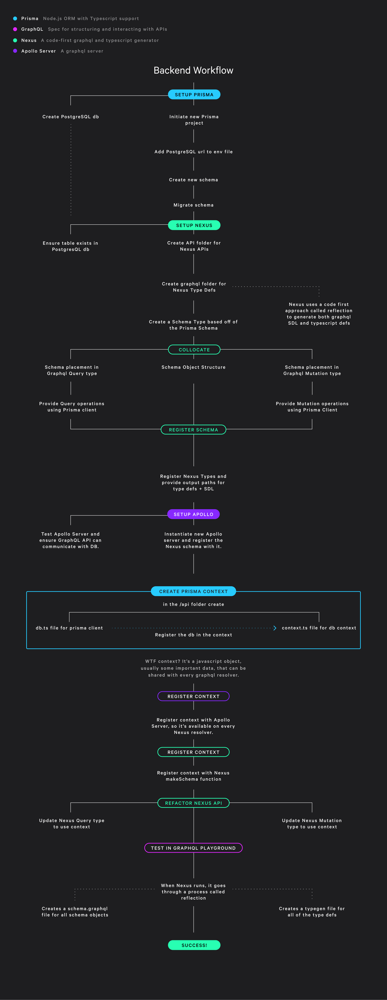

# Prisma with Nexus and GraphQL

This project provides a simple boiler plate for using [Prisma](https://www.prisma.io/), with [Nexus](https://nexusjs.org/), [GraphQL](https://GraphQL.org/), and [Apollo Server](https://www.apollographql.com/docs/apollo-server/).

## What can be achieved?

By using these technologies, you can quickly create a fully typed, GraphQL API that interfaces with a postgreSQL database.

## What are these technologies?

- Prisma is an ORM (Object Relational Mapper) that provides a rich set of type safe APIs for interacting with a SQL database.

- Nexus is a [code-first](https://www.prisma.io/blog/announcing-the-release-of-nexus-schema-v1-b5eno5g08d0b#:~:text=Nexus%20is%20a%20library%20originally,has%20helped%20shape%20its%20evolution), schema generator that provides type safe APIs for creating GraphQL schemas and mutations. When Nexus runs, it goes through a process called [reflection](https://nexusjs.org/docs/getting-started/tutorial/chapter-writing-your-first-schema#reflection), which will generate two files:

  - `nexus-typegen.ts`: a type definition file that incorporates all of your schemas and CRUD ops.
  - `schema.graphql`: a traditional SDL (schema defined language) file

- GraphQL is a spec for structuring and interacting with APIs. It's big benefit is:

  - a single endpoint (usually `/graphql`) for interacting with an API
  - it's self-defining (when it's written it tells you exactly what you will get back)

- Apollo Server is a GraphQL server that provides exactly that. Just give it a GraphQL schema and a port and boom! You've got a running GraphQL server that you can interact with using the `POST` Method.

## Why Nexus?

When working with Prisma and GraphQL, I didn't know I needed something like Nexus. Then I discovered the concept of code-first. Originally, I would write the GraphQL as an SDL in one file and then go through the strenuous process of mapping the Schema to their resolvers in another file. This was time-intensive and bug prone. But Nexus solves this problem, and much more. Here's how:

### Code First:

Nexus provides a code-first approach to GraphQL. So you write code, usually in OOP fashion, to create your GraphQL schemas and mutations.

### Great Typescript Support:

Nexus transpiles that code on the fly to generate a fully typed API. This provides strong type support, intellisense, and auto-complete in vscode!

### Single Source of Truth:

Previously with SDL, schemas we're kept in separate files from Queries and Mutations. This was bug prone and time intensive. Nexus cuts out all of this mapping, and allows collocation of schemas, mutations, and queries in the same file.

### Prisma Integration

Nexus is ORM agnostic, which means it can leverage most ORMs including Prisma. By providing Prisma to the Apollo Server context, it can be used in all Nexus resolvers.

### Prisma Nexus Plugin

Prisma is currently developing an official [Prisma Nexus plugin](https://github.com/prisma/nexus-prisma). The idea is to provide optimizations specifically tailored to Prisma. They recommend not using in production just yet, so for now I haven't included it.

## Wiring all of these up

I have included a flow chart for how all of these pieces get wired up.



## The `tsconfig.json`

The `tsconfig` looks like this:

```
{
  "compilerOptions": {
    "target": "ES2018",
    "module": "commonjs",
    "lib": ["esnext"],
    "strict": true,
    "rootDir": ".",
    "outDir": "build",
    "sourceMap": true,
    "esModuleInterop": true
  }
}
```

Broken down:

- `target` tells typescript to compile to es2018
- `module` tells typescript to compile to `commonjs` format and syntax
- `lib` tells typescript which library to include in compilation, for certain, e.g. `es2018`, syntax support.
- `outDir` tell typescript where to output typescript files when `tsc` is run
- `esModuleInterp` tells typescript to allow `import <module> from <module>` in node js.

## The `package.json`

The `package.json` has been set up to work in a Heroku production environment. Here are the scripts included:

```
  "scripts": {
    "build": "npx prisma generate && npm run build:reflection && tsc",
    "build:reflection": "NEXUS_SHOULD_EXIT_AFTER_REFLECTION=true ts-node --transpile-only ./api/schema.ts",
    "dev": "nodemon --exec 'ts-node --transpile-only' index.ts",
    "dev:migrate": "npx prisma migrate dev",
    "start": "NODE_ENV=production node build/index.js"
  },
```

- `dev` transpiles, but does not type check, the `index.ts` into javascript and keeps it running.

- `dev:migrate` will run a process called migration which syncs the prisma schema with the database schema. This will also generate a new prisma client.

- `build` will run the following commands when deployed to Heroku:

  - `generate` will generate a new prisma client
  - `build:reflection` will run Nexus' reflection process, which generates a typed API and GraphQL schema, and then exit
  - `tsc` will compile all typescript code into javascript code using `tsconfig` specs.

- `start` will run the compiled `index.js` which will spin up the Apollo Server

### Quick note on reflection

It's important to just run reflection on the Nexus schema file itself rather than the `index.ts` file where Apollo server is located. If reflection is run on `index.ts` in a production environment, it will stall the build as the server will spin up on a `localhost`.

## Heroku Build Hooks

Heroku has hooks you can use when it builds your project. They call this build and deploy cycle a .

Essentially, they designate certain scripts, like `build` and `start`, to be called and you can provide those scripts yourself.

They will also run the `Procfile` if included in the project. In ours, we use the `release` hook to migrate Prisma schemas to the database, and the `start` hook to start our server.

## Heroku CLI

[See all CLI commands](https://devcenter.heroku.com/articles/heroku-cli-commands)

Most used commands:

- `heroku whoami`: see who's currently logged in
- `heroku login -i`: login to heroku from CLI
- `heroku logout`: logout of heroku
- `heroku builds -a <YOUR_APP_NAME>`: view all builds in progress
- `heroku plugins:install heroku-builds`: install the builds command
- `heroku builds:cancel -a <YOUR_APP_NAME>`: cancel latest pending build
- `heroku builds:cancel -a <YOUR_APP_NAME> <HEROKU_BUILD_ID>`: cancel a specific build
- `heroku psql -a <YOUR_APP_NAME>`: connect to your heroku postgreSQL database
- `\q`: exit the database

## Testing

One important note. When the project is deployed to Heroku, Apollo Server will spin up. But you may see an error message like:

```
GET query missing.
```

Essentially, GraphQL is expecting a query object. If testing with Postman or Insomnia, be sure to use the `POST` method, as that's what GraphQL expects.

## Helpful links:

### Nexus

- [Nexus Prisma Example](https://github.com/GraphQL-nexus/nexus/tree/main/examples/with-prisma)
- [Announcing Nexus 1.0](https://www.prisma.io/blog/announcing-the-release-of-nexus-schema-v1-b5eno5g08d0b#:~:text=Nexus%20is%20a%20library%20originally,has%20helped%20shape%20its%20evolution.)
- [Nexus Getting Started Tutorial](https://nexusjs.org/docs/getting-started/tutorial)

### Apollo Server

- [Apollo Server APIs](https://www.apolloGraphQL.com/docs/apollo-server/api/apollo-server/)

### Prisma

- [Apollo and Prisma](https://www.prisma.io/apollo)

### Heroku

- [Auto migrate heroku](https://rubyyagi.com/auto-migrate-heroku/)
- [The Heroku release phase](https://blog.heroku.com/announcing-release-phase-run-tasks-before-new-release-deployed)
- [Using the Procfile](https://blog.heroku.com/the_new_heroku_1_process_model_procfile#defining-an-app-process-types-via-procfile)
- [Heroku Runtime Principles](https://devcenter.heroku.com/articles/runtime-principles)
- [Deploy Apollo Server to Heroku](https://www.apolloGraphQL.com/docs/apollo-server/deployment/heroku/)
- [Deploy Prisma to Heroku](https://www.prisma.io/docs/guides/deployment/deploying-to-heroku)
